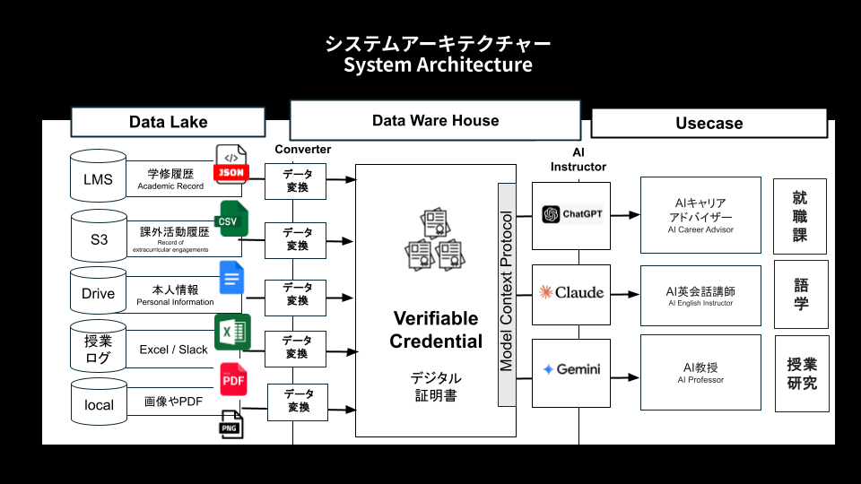
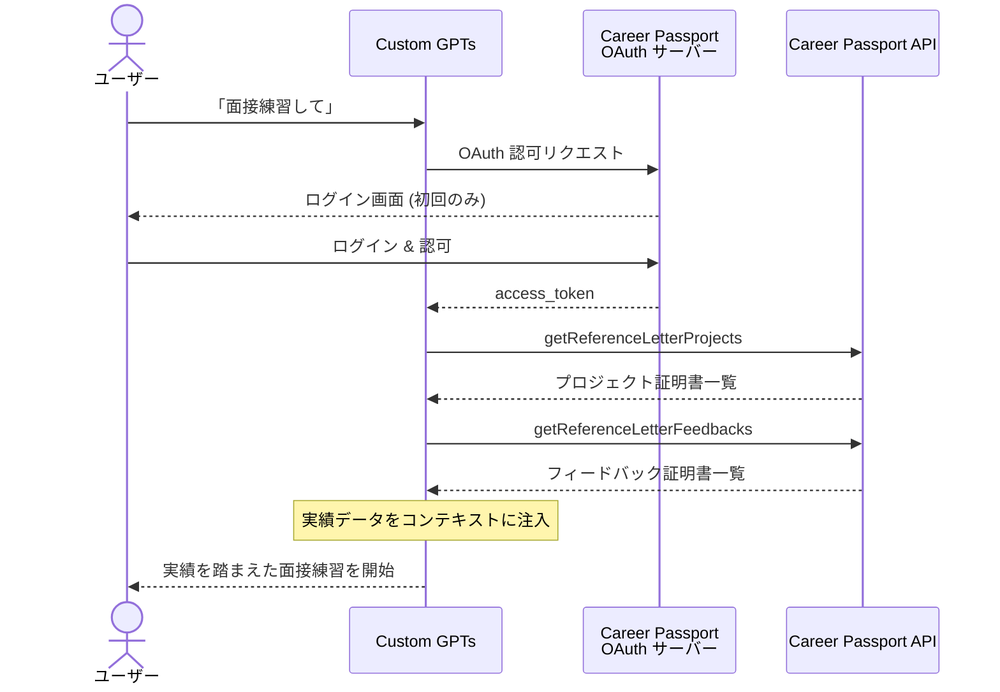
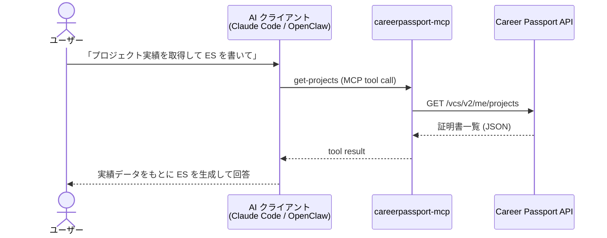
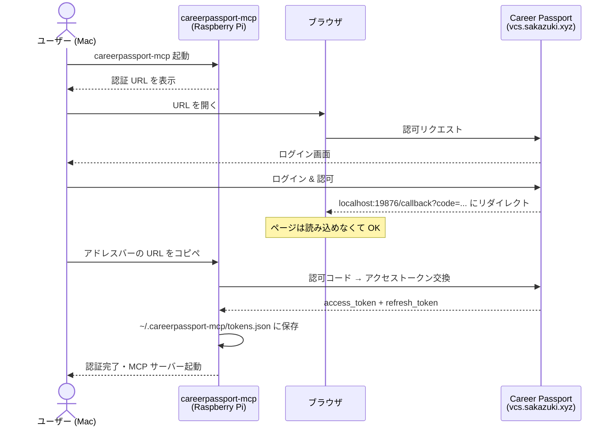

# careerpassport-mcp

Career Passport API v2 の MCP (Model Context Protocol) サーバー。
Claude Code や OpenClaw などの AI ツールから、キャリアパスポートの証明書取得・発行・RAG 検索を自然言語で操作できます。

---

## キャリアパスポートとは

**キャリアパスポート**は、[DOU 社](https://dou.jp)が複数の大学・高校・企業に SaaS 提供する「学習履歴 × キャリア支援データ」統合プラットフォームです。大学・高校・企業が学生や社員の実績を **Verifiable Credential (VC)** として発行し、本人が持ち歩けるデジタル証明書として管理します。

### システムアーキテクチャ



### 主なユーザー

| ユーザー | 活用シーン |
|---------|-----------|
| 大学生 | キャリアセンターの AI アドバイザーと自己分析・ES 作成・面接練習 |
| 高校生 | 活動記録・進路サポートのデータ蓄積 |
| 外国人労働者 | 日本語学習ログの蓄積と能力証明 |

### 発行できる証明書の種類

| 証明書 | 内容 |
|--------|------|
| **プロジェクト証明書** | 担当業務・役割・期間・チーム構成・成果などの業務・学習経験 |
| **フィードバック証明書** | カテゴリ別定量スコア（思考力・コミュニケーション等）と定性コメント |
| **GPA 証明書** | 学業成績・学習記録 |
| **受賞証明書** | MVP・表彰・バッジなどの受賞実績 |

### Custom GPTs との連携

Career Passport API は **ChatGPT の Custom GPTs (Actions)** に直接繋いで使うこともできます。GPTs に学生の実績データをコンテキストとして持たせ、面接練習・ES 添削・キャリア相談などの特化型 GPT を構築できます。

#### 連携フロー



#### セットアップ手順

1. `admin.sakazuki.xyz/oauth-clients` の「Holder 向け API 認証設定」から OAuth クライアントを作成（シークレットは一度しか表示されないのでメモ）
2. GPTs の「構成 > アクションを作成する」で以下を設定

**認証設定:**

| 項目 | 値 |
|------|----|
| 認証タイプ | OAuth |
| クライアント ID | Career Passport 管理画面で発行したクライアント ID |
| クライアントシークレット | Career Passport 管理画面で発行したシークレット |
| 認証 URL (production) | `https://vcs.sakazuki.xyz/oauth2/authorize` |
| トークン URL (production) | `https://vcs.sakazuki.xyz/oauth2/token` |
| スコープ | (空のまま) |

**API スキーマのインポート:**「URL からインポートする」で以下を指定

- Production: `https://api.sakazuki.xyz/docs/holders/v2/yaml`
- Staging: `https://api.staging.sakazuki.xyz/docs/holders/v2/yaml`

3. アクション作成後に発行されるコールバック URL を、Career Passport 管理画面の OAuth クライアントのリダイレクト URI に登録

> **注意:** API スキーマを編集するとコールバック URL が変わります。変更時は都度登録し直してください。

#### GPT プロンプトへの追加

Career Passport のデータを活用する GPT を作る場合、システムプロンプトの末尾に以下を追加します。

```
## キャリアパスポート API 一覧

| エンドポイント | 用途 | 全件取得 | ページングキー | 終了条件 |
|----------------|------|:--------:|---------------|---------|
| `getReferenceLetterProjects` | プロジェクト証明書 | ✅ | `nextOffset` | `nextOffset === null` |
| `getReferenceLetterFeedbacks` | フィードバック証明書 | ❌ | - | - |
| `getReferenceLetterAwards` | 受賞証明書 | ❌ | - | - |

- 空データ時は必ず「該当実績はありませんでした」と明記してください。
- 全件取得が必要なエンドポイントは nextOffset が null になるまでループ呼び出しを完了させてから、ユーザーとの会話を再開してください。
```

#### GPT 活用例

| GPT 名 | 概要 |
|--------|------|
| 面接対策 GPT | 実績データを引用して面接練習・フィードバックを提供 |
| ES 添削 GPT | プロジェクト・フィードバック証明書をもとに ES をブラッシュアップ |
| キャリア相談 GPT | 蓄積した実績から強み分析・キャリアパス提案 |

---

## この MCP が提供するもの

`careerpassport-mcp` は、キャリアパスポート API v2 を MCP プロトコル経由で AI ツールに公開します。

**できること:**

- 自分のプロジェクト・フィードバック・GPA・受賞実績を AI に読み込ませる
- 実績データをもとに ES 添削・面接練習・職務経歴書作成を AI に依頼する
- RAG コーパスを使って実績に根ざした文章を自動生成する
- 新しい証明書をチャットから発行する

**アーキテクチャ:**

```
AI クライアント (Claude Code / OpenClaw など)
        │  MCP (stdio)
        ▼
careerpassport-mcp
        │  OAuth 2.0 + REST API
        ▼
Career Passport API v2 (api.sakazuki.xyz)
```

**ツール呼び出しのシーケンス:**



---

## 提供ツール

### 証明書の取得

| ツール | 説明 |
|--------|------|
| `get-projects` | プロジェクト証明書一覧を取得。組織 ID フィルタ・自動ページネーション対応 |
| `get-feedbacks` | フィードバック証明書一覧を取得。定量スコアと定性コメントを含む |
| `get-gpas` | GPA 証明書一覧を取得 |
| `get-awards` | 受賞証明書一覧を取得 |
| `get-organizations` | 所属組織一覧を取得。他ツールのフィルタ用 ID を確認できる |

### 証明書の発行

| ツール | 説明 |
|--------|------|
| `issue-project` | プロジェクト証明書を発行。担当業務・期間・役割・成果などを指定 |
| `issue-feedback` | フィードバック証明書を発行。カテゴリ別スコアと強み・成長コメントを指定 |

### RAG (検索・生成)

| ツール | 説明 |
|--------|------|
| `rag-retrieval` | キャリアパスポートの RAG コーパスを検索し、関連コンテキストをスコア付きで返す |
| `rag-generation` | RAG コーパスを使い、実績データに根ざしたテキストを生成する |

---

## セットアップ (Raspberry Pi / ヘッドレス環境)

### 前提条件

- Node.js 18 以上
- Career Passport の OAuth クライアント `client_id` / `client_secret`
  - `admin.sakazuki.xyz/oauth-clients` の「Holder 向け API 認証設定」から作成

### 1. 環境変数の設定

任意のディレクトリに `.env` ファイルを作成します。

```bash
mkdir -p ~/careerpassport-mcp && cd ~/careerpassport-mcp

cat <<'EOF' > .env
CP_CLIENT_ID=your_oauth_client_id
CP_CLIENT_SECRET=your_oauth_client_secret
CP_ENVIRONMENT=production
EOF
```

| 変数 | 必須 | 説明 |
|------|------|------|
| `CP_CLIENT_ID` | Yes | OAuth クライアント ID |
| `CP_CLIENT_SECRET` | Yes | OAuth クライアントシークレット |
| `CP_ENVIRONMENT` | No | `production` (デフォルト) または `staging` |
| `CP_ACCESS_TOKEN` | No | 手動設定時のアクセストークン (設定すると OAuth フローをスキップ) |
| `CP_REFRESH_TOKEN` | No | 手動設定時のリフレッシュトークン |

### 2. OAuth リダイレクト URI の設定

Career Passport の管理画面で、OAuth クライアントのリダイレクト URI に以下を追加してください。

```
http://localhost:19876/callback
```

### 3. 初回認証 (SSH 経由のヘッドレス環境)

Raspberry Pi に SSH で接続した状態で MCP サーバーを起動すると、初回は OAuth 認証フローが走ります。



```
$ cd ~/careerpassport-mcp
$ careerpassport-mcp

=== Career Passport OAuth Authentication ===

1. Open this URL in your browser:

  https://vcs.sakazuki.xyz/oauth2/authorize?response_type=code&client_id=...&redirect_uri=http%3A%2F%2Flocalhost%3A19876%2Fcallback&state=...

2. Log in and authorize the application.
3. The browser will redirect to a URL that may fail to load.
4. Copy the FULL URL from the browser address bar and paste it here:

Callback URL>
```

手順:

1. 表示された URL を **Mac のブラウザ** で開く
2. Career Passport にログインして認可する
3. ブラウザが `http://localhost:19876/callback?code=...&state=...` にリダイレクトされる (ページは読み込めなくて OK)
4. ブラウザのアドレスバーから **URL 全体をコピー**
5. SSH ターミナルに戻って `Callback URL>` のプロンプトに **ペースト** して Enter

認証が成功するとトークンが `~/.careerpassport-mcp/tokens.json` に保存されます。
次回以降の起動では自動的に保存済みトークンが使われます。
トークンの有効期限が切れた場合はリフレッシュトークンで自動更新されます。

### 4. AI クライアントへの登録

#### OpenClaw / Claude Code

設定ファイルの `mcpServers` に追加します。

```json
{
  "mcpServers": {
    "careerpassport": {
      "command": "careerpassport-mcp",
      "env": {
        "CP_CLIENT_ID": "your_oauth_client_id",
        "CP_CLIENT_SECRET": "your_oauth_client_secret",
        "CP_ENVIRONMENT": "production"
      }
    }
  }
}
```

または `.env` ファイルがあるディレクトリから起動する場合:

```json
{
  "mcpServers": {
    "careerpassport": {
      "command": "careerpassport-mcp",
      "cwd": "/home/pi/careerpassport-mcp"
    }
  }
}
```

---

## 使用例

MCP サーバーを登録した AI クライアントから、以下のような指示が使えます。

```
キャリアパスポートのプロジェクト実績を全部取得して、職務経歴書のドラフトを作って
```

```
私のフィードバック証明書を見て、面接でアピールすべき強みを3つ教えて
```

```
直近のプロジェクトを issue-project で発行して。担当業務はバックエンドAPI開発、期間は2024-04〜2024-12
```

---

## トラブルシューティング

### 再認証が必要な場合

```bash
rm ~/.careerpassport-mcp/tokens.json
```

保存済みトークンを削除して再起動すると、OAuth フローが再度実行されます。

---

## 開発

```bash
git clone https://github.com/TatsuyaIshibe/careerpassport-mcp.git
cd careerpassport-mcp
npm install
npm run build
npm test
```

---

## ライセンス

MIT
